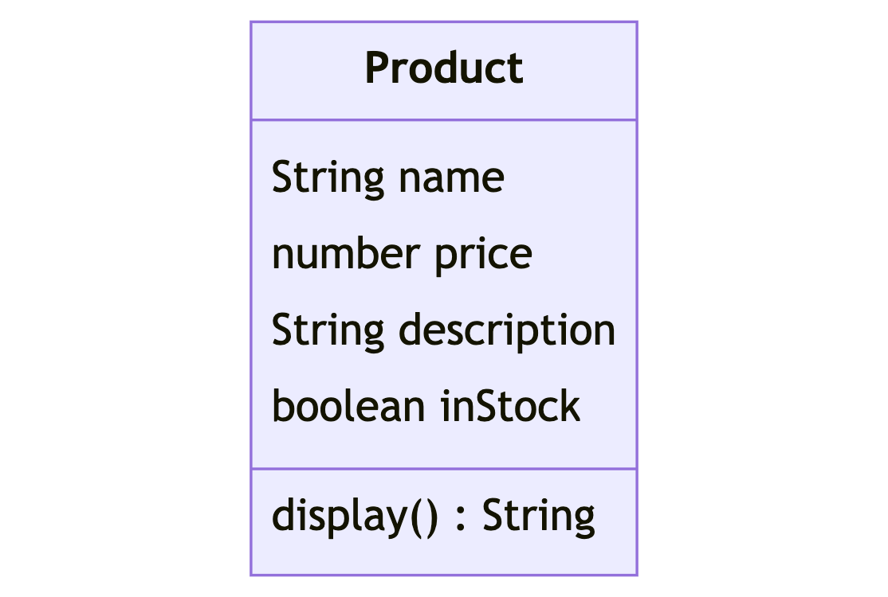
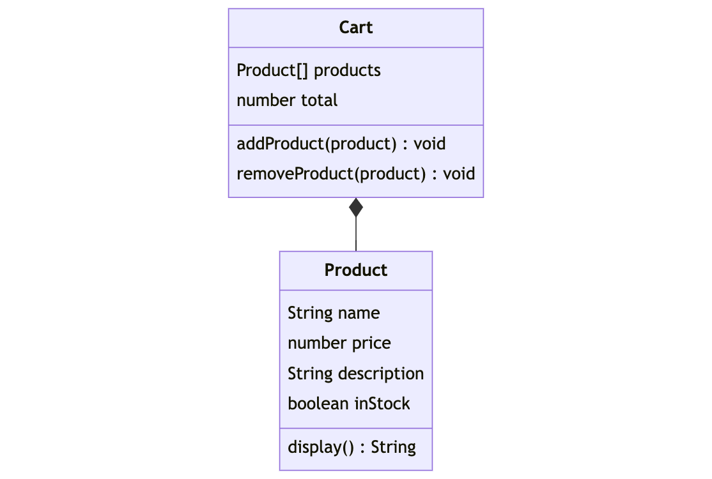
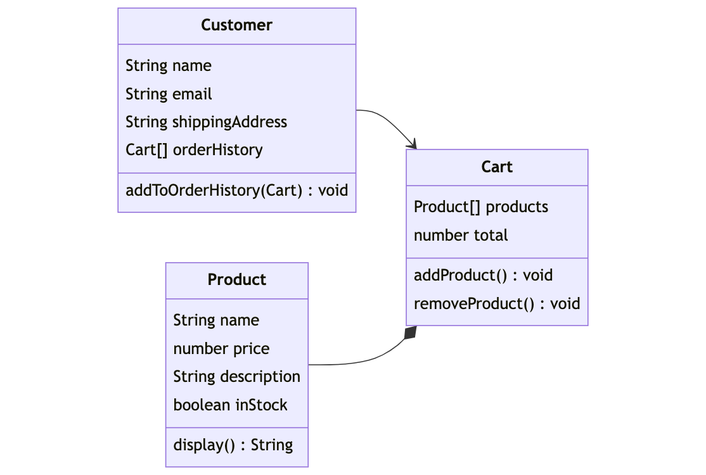
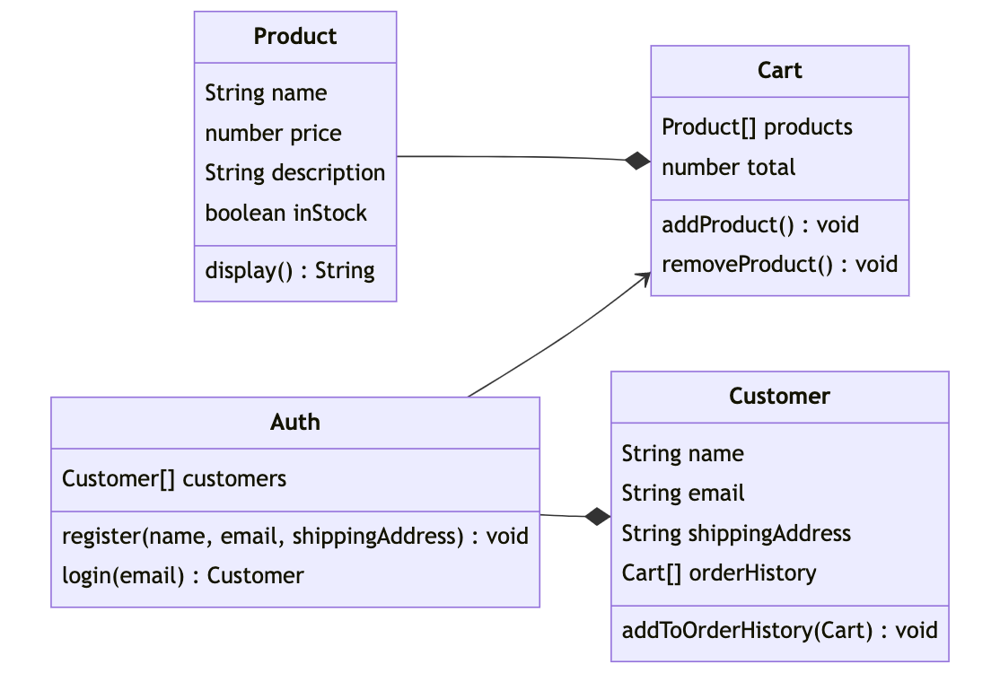

# FarmersList 🧑‍🌾

You are a startup founder building a new online marketplace that connects small, independent farmers with consumers who are passionate about buying local and supporting sustainable agriculture. In this marketplace, farmers will be able to create profiles and list their products, and consumers will be able to browse and purchase products directly from the farmers. 

## Running Code and Tests 

1. You can run any of the files with the command `node PATH_TO_FILE`.
2. To run the tests, do the following in the root folder of this project:

```shell
npm install
npm test
```

## `Product`



1. In `Product.js`, create a class called `Product` using the following class diagram above. `Product` should have the following properties and methods:
    - **Properties**
        - `name`, `price`, and `description` are set by the constructor method.
        - `inStock` is set to `true` when the instance of the class is created.
    - **Methods**
        - `display()` returns a string in the following format `"Name: <NAME>, Price: $<PRICE>, Description: <DESCRIPTION>"`.
2. Export the class using `module.exports`.
3. Import the class into `index.js` with the name `Product`.
4. Save and run `npm test`. The first 3 tests should now pass.

### Example
```javascript
const carrots = new Product("Carrots", 4, "Bushel of carrots that have been freshly harvested for you");

carrots.inStock; // true
carrots.display(); // "Name: Carrots, Price: $4, Description: Bushel of carrots that have been freshly harvested for you"
```

## `Cart`
As your online marketplace grows, you realize that users need a way to save products they want to buy for later. To address this, you decide to build a `Cart` object that will allow users to add and remove products.



1. In `Cart.js`, create a class called `Cart` using the class diagram above. `Cart` should have the following properties and methods:
    - **Properties**
        - `products`: An array that will store instances of `Product` that have been added to the cart. Starts as an empty array.
        - `total`: A number representing the total cost of all products in the cart. Starts with a value of 0.
    - **Methods**
        - `addProduct`: A method that adds a `Product` instance to the **end** of the `products` array and updates the `total` property accordingly.
        - `removeProduct(i)`: A method that removes a `Product` instance from the `products` array at a specified index `i` and updates the `total` property accordingly.
2. Export the class using `module.exports`.
3. Import the class into `index.js` with the name `Cart`.
4. Save and run `npm test`. 6 tests should now pass.

### Example

```JavaScript
const strawberries = new Product("Strawberries", 5, "The freshest fresas on the market");
const carrots = new Product("Carrots", 2, "Perfect for an afternoon snack");
const mangos = new Product("Mangos", 3, "The tastiest fruit you can buy");

const myCart = new Cart();
myCart.addProduct(strawberries);
myCart.addProduct(mangos);
myCart.products; // [Product { ... }, Product { ... }]
myCart.total; // 8

myCart.removeProduct(1);
myCart.products; // [Product { ... }]
myCart.total; // 5
```

## `Customer`

With the `Product` and `Cart` classes in place, you've got the basic building blocks for a fully functional online marketplace. However, you're missing a key piece of the puzzle: customers!



1. Every `Customer` can has a `Cart` that can contain many `Product` items. In `Customer.js`, create a class called `Customer` using the class diagram above. `Customer` should have the following properties and methods:
    - **Properties**
        - `name`, `email`, and `shippingAddress` are set by the constructor method.
        - `orderHistory` contains an array of past `Cart` items. It initializes as an empty array.
    - **Methods**
        - `addToOrderHistory(cart)`: adds a `Cart` instance to the end of the `orderHistory` array.

2. In `Customer.js`, export the `Customer` class using `module.exports`.
3. Import the class into `index.js` with the name `Customer`.
4. Save and run `npm test`. 9 tests should now pass.

### Examples
```javascript
const melanie = new Customer("Melanie", "melanie@gmail.com", "22 Main St");
const strawberries = new Product("Strawberries", 5, "The freshest fresas on the market");
const carrots = new Product("Carrots", 2, "Perfect for an afternoon snack");
const mangos = new Product("Mangos", 3, "The tastiest fruit you can buy");

const myFirstOrder = new Cart();
myFirstOrder.addProduct(mangos);
myFirstOrder.addProduct(carrots);

const mySecondOrder = new Cart();
mySecondOrder.addProduct(strawberries);

melanie.addToOrderHistory(myFirstOrder);
melanie.addToOrderHistory(mySecondOrder);

melanie.orderHistory; 
/*
[ 
    Cart { products: [ [Product], [Product] ], total: 5 },
    Cart { products: [ [Product] ], total: 5 },
]
*/
```

## `Auth`

With the `Product`, `Cart`, and `Customer` classes in place, your online marketplace is starting to take shape. However, we need to verify the customers are who they say they are. We will do this with an `Auth` class.



1. In `Auth.js`, create a class called `Auth` using the class diagram above. Create a new class `Auth` with the following properties and methods:
    - **Properties**
        - `customers`: an array that will store instances of the `Customer` class representing all registered customers. Initializes as an empty array.
    - **Methods**
        - `register(name, email, shippingAddress)`: a method that creates a new `Customer` instance with the provided information and adds it to the `customers` array
        - `login(email)`: a method that takes an `email` as an argument and returns the corresponding `Customer` instance from the `customers` array.
2. Export the `Auth` class using `module.exports`.
3. Import the class into `index.js` with the name `Auth`.
4. Save and run `npm test`. All tests should now pass.

### Examples
```javascript
let auth = new Auth();
auth.register("Kaiya", "Kaiya@example.com", '121 Main St');
auth.register("Nina", "Nina@example.com", '22 Broadway St');

console.log(auth.login("Kaiya@example.com"));
/*
{ name: 'Kaiya', email: 'jKaiya@example.com', shippingAddress: '121 Main St' }
}
*/

console.log(auth.login("benny@example.com")); // null
```

## Stretch: Enhance Your FarmersList! 🚀

Business is booming! Here are few extensions you can add to your existing code:

1. Add a `getTotal` method to the `Cart` class that returns the total price of all items in the cart.
2. Add a `clear` method to the `Cart` class that clears all `products` from the cart and sets `total` back to `0`.
3. Add a `rewardPoints` property to the `Product` class constructor that denotes how many reward points each item gets. In the `Customer` class:
    - Create a `rewardPoints` property that initializes with a value of zero.
    - Create a `getRewardPoints` method that goes through the `orderHistory` and updates `rewardPoints` with the number of `rewardsPoints` that the customer has earned based on their order history.
4. Add a `removeItemByName` method to the `Cart` class that removes a specified item from the cart. This method should take in a `Product` name as an argument and remove that item from the cart.
5. `quantity`: We have more than 1 of many items in stock. Do the following:
    - Update `Product` constructor to accept a property of `quantity`. 
    - Update the `Cart` method `addProduct(product, quantity)` to accept a `quantity` argument. The method should:
        - Check that the `product` has enough quantity to complete the command. If the amount requested is greater than the amount available return `I'm sorry there are only QUANTITY of this product left`. 
        - If there is enough of the `quantity`, add the item to the cart, increase the `total`, and then decrease the products quantity.
        - Check if `product` now has a quantity of `0`. If it does, set `inStock` to `false`.
        - Return the updated `Product`.